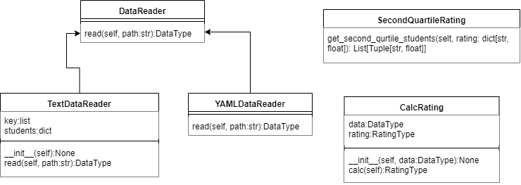

# Lab01_TP
1 Лабораторная работа по дисциплине "Технологии Программирования"

## Индивидуальное задание
`Вариант 8:` Определить и вывести на экран всех студентов, чей рейтинг попадает во вторую квартиль распределения порейтингам.

## UML Диаграмма классов
